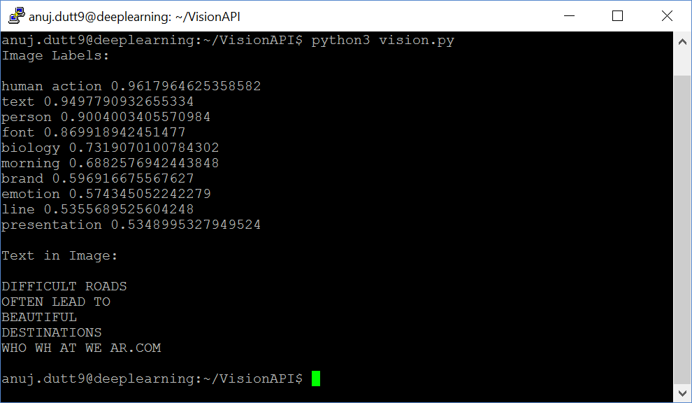

# Google-API-Tutorial

***This repository contains the code for general Google API's usage using Python followed by a small project.***

# Requirements
1. **Python3**
2. **Google-Cloud sdk**
```
pip3 install google-cloud
```


# Outcomes

* NLP API


* Translation API


* Vision API

 


# Resources

| S.No.  |                       Papers / Blogs / Authors            |                        Paper Links                   |
| ------ | --------------------------------------------------------- | ---------------------------------------------------- |
|1.      | 					Google Cloud Vision Documentation 		 | 			    https://cloud.google.com/vision/docs/   |
|2.      |                 Google Translation API Documentation      |             https://cloud.google.com/translate/docs/ |
|3.      |     Google Natural Language Processing API Documentation  | https://cloud.google.com/natural-language/docs/reference/rest/ |
